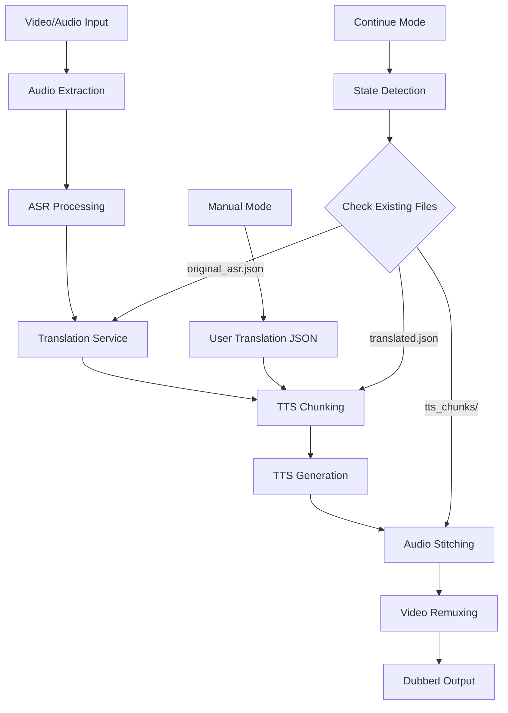

# Design Document

## Overview

The dubbing pipeline extends the existing ASR-enabled Gradio application with translation and text-to-speech capabilities using Google's Gemini models. The system maintains the current ASR workflow while adding a complete translate-and-dub pipeline that can operate in both automatic and manual modes. The architecture emphasizes modularity, error resilience, and resumable operations through persistent intermediate storage.

## Architecture

### High-Level Architecture



### System Components

1. **Pipeline Controller** - Orchestrates the entire workflow and manages state persistence
2. **Translation Service** - Handles Gemini API calls for translation with fallback logic
3. **TTS Service** - Manages text-to-speech generation with chunking and voice consistency
4. **Audio Processing** - Handles audio extraction, chunking, and final synchronization
5. **State Manager** - Manages persistent storage and resumable operations
6. **UI Controller** - Extended Gradio interface for pipeline configuration and control

## Components and Interfaces

### Pipeline Controller (`pipeline_controller.py`)

**Primary Functions:**
- `run_automatic_pipeline(video_path, api_keys, style_config, voice_name, progress_callback)`
- `run_manual_pipeline(video_path, translated_json, api_keys, voice_name, progress_callback)`
- `continue_from_checkpoint(progress_callback)`
- `detect_pipeline_state()` - Returns current stage based on existing files

**State Management:**
- Maintains pipeline state in `pipeline_state.json`
- Tracks current stage, processed chunks, and error recovery attempts
- Provides rollback capabilities for failed operations

### Translation Service (`translation.py`)

**Core Interface:**
```python
class TranslationService:
    def __init__(self, api_keys: List[str], fallback_models: List[str])
    def translate_segments(self, segments: List[dict], style_config: dict) -> List[dict]
    def _make_translation_request(self, segments: List[dict], style_config: dict, model: str, api_key: str) -> dict
    def _handle_api_error(self, error: Exception, model: str, api_key_index: int) -> bool
```

**Fallback Model Priority:**
1. gemini-2.5-flash
2. gemini-2.5-pro
3. gemini-2.5-pro-preview-06-05
4. gemini-2.5-pro-preview-05-06
5. gemini-2.5-pro-preview-03-25
6. gemini-2.5-flash-preview-05-20
7. gemini-2.5-flash-preview-04-17
8. gemini-2.5-flash-lite-preview-06-17
9. gemini-2.0-pro
10. gemini-2.0-flash-001
11. gemini-2.0-flash-lite-001
12. gemini-1.5-pro-002
13. gemini-1.5-pro-001
14. gemini-1.5-flash-002
15. gemini-1.5-flash-001

**Translation Request Format:**
```json
{
  "system": "You are a translator. Style: {tone}, Dialect: {dialect}, Genre: {genre}. Input payload: { segments: [ {start,end,text}, … ] }. Return: JSON array of {start, end, text_translated} in the same order.",
  "user_input": {
    "segments": [
      {"start": 0.0, "end": 2.5, "text": "Hello world"},
      {"start": 2.5, "end": 5.0, "text": "How are you?"}
    ]
  }
}
```

### TTS Service (`tts.py`)

**Core Interface:**
```python
class TTSService:
    def __init__(self, api_keys: List[str], voice_name: str)
    def generate_tts_chunks(self, translated_segments: List[dict], progress_callback) -> str
    def _calculate_token_chunks(self, segments: List[dict], max_tokens: int = 30000) -> List[List[dict]]
    def _generate_chunk_audio(self, chunk_segments: List[dict], chunk_index: int) -> List[str]
    def _ensure_audio_duration(self, audio_path: str, expected_duration: float) -> str
```

**TTS Model Priority:**
1. gemini-2.5-flash-preview-tts
2. gemini-2.5-pro-preview-tts

**Chunking Strategy:**
- Calculate total tokens using tiktoken or similar tokenizer
- Group segments into chunks ≤30,000 tokens
- Preserve original timestamps for synchronization
- Handle chunk splitting for oversized segments

**Audio Duration Matching:**
- Use FFmpeg to trim/stretch audio to match expected duration
- Apply time-scaling algorithms for natural speech preservation
- Validate audio duration matches segment timing

### Audio Processing (`audio_utils.py`)

**Extended Functions:**
- `stitch_audio_chunks(chunk_directory: str, output_path: str) -> str`
- `sync_audio_with_video(video_path: str, audio_path: str, output_path: str) -> str`
- `validate_audio_sync(video_path: str, segments: List[dict]) -> bool`

**Synchronization Process:**
1. Sort TTS chunks by timestamp order
2. Concatenate using FFmpeg with precise timing
3. Apply audio normalization for consistent volume
4. Remux with original video using FFmpeg
5. Validate final A/V sync accuracy

### State Manager (`state_manager.py`)

**Persistent Files:**
- `original_asr.json` - ASR output with timestamps
- `translated.json` - Translated segments with preserved timing
- `tts_chunks/` - Individual audio files per chunk
- `pipeline_state.json` - Current processing state and metadata
- `pipeline.log` - Comprehensive operation logging

**State Detection Logic:**
```python
def detect_current_stage() -> str:
    if not os.path.exists('original_asr.json'):
        return 'asr_needed'
    elif not os.path.exists('translated.json'):
        return 'translation_needed'
    elif not os.path.exists('tts_chunks/') or len(os.listdir('tts_chunks/')) == 0:
        return 'tts_needed'
    elif not os.path.exists('output_dubbed.mp4'):
        return 'stitching_needed'
    else:
        return 'complete'
```

## Data Models

### ASR Segment Model
```python
@dataclass
class ASRSegment:
    start: float
    end: float
    text: str
```

### Translated Segment Model
```python
@dataclass
class TranslatedSegment:
    start: float
    end: float
    text_translated: str
    original_text: str  # Optional for reference
```

### TTS Chunk Model
```python
@dataclass
class TTSChunk:
    chunk_index: int
    segments: List[TranslatedSegment]
    audio_file_path: str
    token_count: int
    generation_timestamp: datetime
```

### Pipeline State Model
```python
@dataclass
class PipelineState:
    current_stage: str
    video_path: str
    mode: str  # 'automatic' or 'manual'
    api_keys: List[str]
    voice_name: str
    style_config: dict
    processed_chunks: List[int]
    error_count: int
    last_updated: datetime
```

## Error Handling

### API Error Recovery
1. **Quota Exhaustion**: Rotate to next API key and model combination
2. **Network Errors**: Implement exponential backoff with max 3 retries
3. **Model Unavailability**: Skip to next model in fallback list
4. **Invalid Response**: Log error and retry with different model

### TTS Chunk Error Handling
1. **Oversized Chunks**: Automatically split chunk in half and retry
2. **Duration Mismatch**: Apply audio time-scaling to match expected duration
3. **Audio Generation Failure**: Retry with alternative TTS model
4. **File System Errors**: Create backup chunk storage location

### State Recovery
1. **Corrupted JSON Files**: Attempt repair or prompt user for manual intervention
2. **Missing Intermediate Files**: Restart from last valid checkpoint
3. **Partial Chunk Generation**: Resume from last successfully generated chunk
4. **Process Interruption**: Detect incomplete operations and offer continuation

## Testing Strategy

### Unit Testing
- **Translation Service**: Mock Gemini API responses, test fallback logic
- **TTS Service**: Test chunking algorithms, audio duration validation
- **State Manager**: Test persistence, recovery, and state detection
- **Audio Processing**: Test synchronization accuracy, file format handling

### Integration Testing
- **End-to-End Pipeline**: Test complete automatic and manual workflows
- **Error Recovery**: Simulate API failures and validate fallback behavior
- **State Persistence**: Test interruption and continuation scenarios
- **Multi-Language Support**: Validate translation quality across different languages

### Performance Testing
- **Large File Handling**: Test with videos >1 hour duration
- **Concurrent Processing**: Validate thread safety and resource management
- **Memory Usage**: Monitor memory consumption during chunking operations
- **API Rate Limiting**: Test behavior under various quota constraints

### User Acceptance Testing
- **UI Responsiveness**: Ensure smooth progress updates during long operations
- **Error Messaging**: Validate clear, actionable error messages
- **File Management**: Test upload, download, and intermediate file handling
- **Voice Quality**: Validate TTS output quality across different voice options

## Security Considerations

### API Key Management
- Store API keys in memory only, never persist to disk
- Implement key rotation logging without exposing actual keys
- Validate API key format before making requests
- Clear API keys from memory on application shutdown

### File System Security
- Validate all file paths to prevent directory traversal
- Implement temporary file cleanup procedures
- Restrict file access permissions for intermediate storage
- Sanitize user-provided JSON input to prevent injection attacks

### Network Security
- Use HTTPS for all Gemini API communications
- Implement request timeout limits to prevent hanging connections
- Validate SSL certificates for API endpoints
- Log security-relevant events without exposing sensitive data